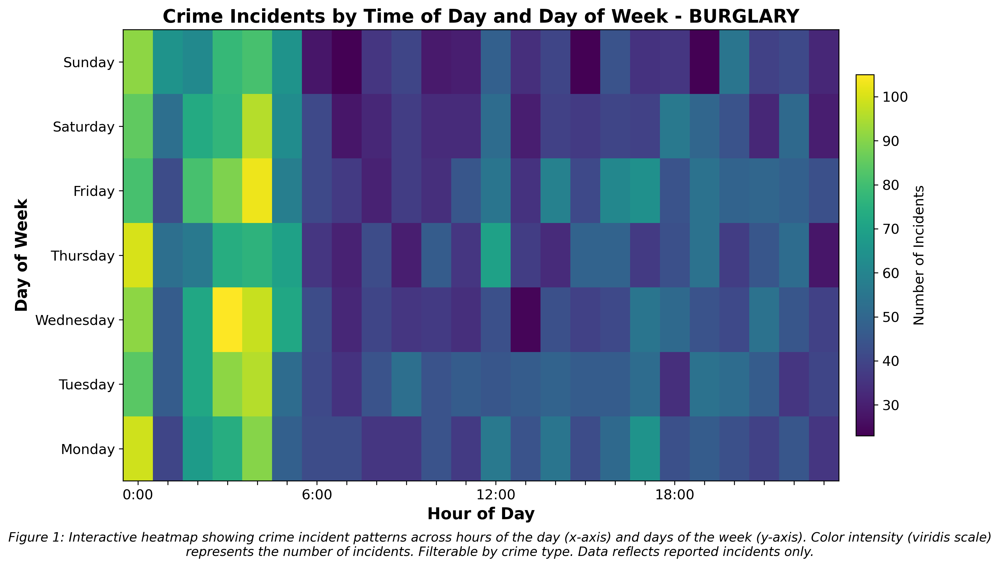
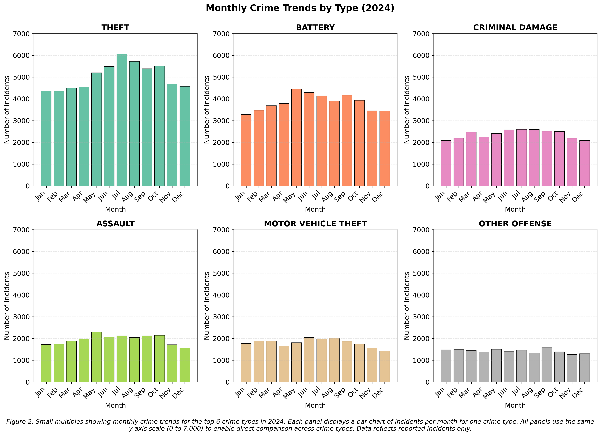
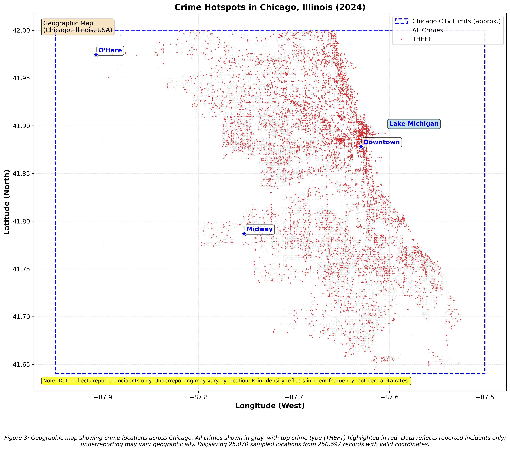

# Chicago Crime Data Visualization: Final Report

This report presents three visualizations analyzing temporal and spatial crime patterns in Chicago using 2024 crime data. The visualizations are designed for law enforcement officials, city planners, and public safety decision-makers.

## Visualizations

### Figure 1: Interactive Temporal Crime Patterns Heatmap

Interactive heatmap showing crime incident patterns across hours of the day (x-axis) and days of the week (y-axis). Color intensity (viridis scale) represents the number of incidents. Filterable by crime type. Data reflects reported incidents only.

**Key Insight**: Peak activity during evening hours (6-10 PM) and weekends, with distinct temporal signatures for different crime types.

---

### Figure 2: Monthly Crime Trends by Type (Small Multiples)

Small multiples showing monthly crime trends for the top 6 crime types in 2024. All panels use the same y-axis scale (0 to 7,000) to enable direct comparison. Data reflects reported incidents only.

**Key Insight**: THEFT is consistently the highest-volume crime type (4,000-5,000/month), far exceeding other types.

---

### Figure 3: Crime Hotspot Map (Geographic)

Geographic map showing crime locations across Chicago. All crimes shown in gray, with top crime type (THEFT) highlighted in red. Landmark markers provide geographic context. Data reflects reported incidents only; underreporting may vary geographically.

**Key Insight**: Crime clusters heavily in downtown and along transportation corridors, with THEFT showing dense clustering in commercial areas.

---

## Documentation

For detailed information, see:
- **Executive Summary**: `executive_summary.md` - Audience, problem, key insights, and hero figure
- **Method & Design Notes**: `method_design_notes.md` - Complete methodology, design choices, limitations, and ethics discussion

## Reproducibility

All visualizations can be regenerated using:
- **Notebook**: `visualizations.ipynb` - Complete implementation code
- **Build Script**: `./run_all.sh` - Automated setup and execution
- **Data**: `../data/Crimes_-_2001_to_Present_20251118.csv`

See `README.md` for detailed setup instructions.

---

**Data Source**: City of Chicago Data Portal  
**License**: Public domain  
**Project Repository**: See main `../README.md` for full documentation
